# 📰 News App (Flutter)

A Flutter-based mobile application that displays the latest news articles categorized by topic. It
uses clean UI design principles and dynamic data rendering to deliver a simple and intuitive user
experience. The app supporting **English and Arabic** languages and also supporting **Light Mode and
Dark Mode**.

  

---

## 📹 App Demo:

- watch this video:

https://www.loom.com/share/5d80bb341ae348c8be8fd865f834a2f5?sid=cf0c963a-f43b-48e4-b1c2-1e52d52c7bbc

---

## 📱 Features

- **🗂️ Category-Based Browsing:**  
  Browse news articles by categories such as Sports, Health, Business, Science, Technology, and
  more.

- **✅ Live News Fetching (via Dummy Data):**  
  The app is currently using local dummy data to simulate a live news API.

- **🔍 Search Functionality:**  
  Easily search news articles by keyword using the built-in search bar on the home screen.

- **🌐 Multi-Language Support:**  
  The app supports both **English** and **Arabic** languages.

- **🌗 Light & Dark Mode:**  
  Toggle between light and dark themes with smooth transitions using `ThemeMode` and `AppTheme`.

- **📱 Responsive UI:**  
  Clean and modern layout built with reusable components like `CategoryCard`, `NewsListTile`, and
  `NewsTile`.

- **➡ Navigation:**  
  Tappable category cards route users to a filtered list of articles within the selected category.

---

## 📸 screenshots

### 🟦 Splash Screen

  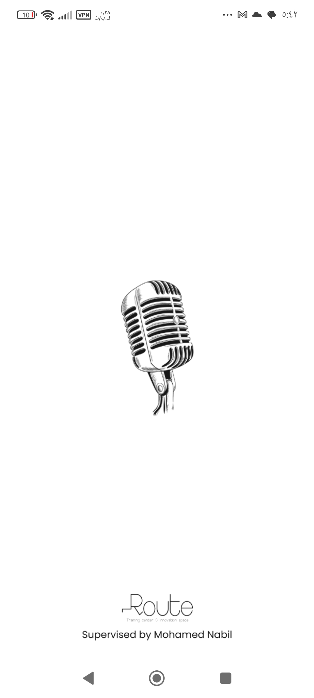
  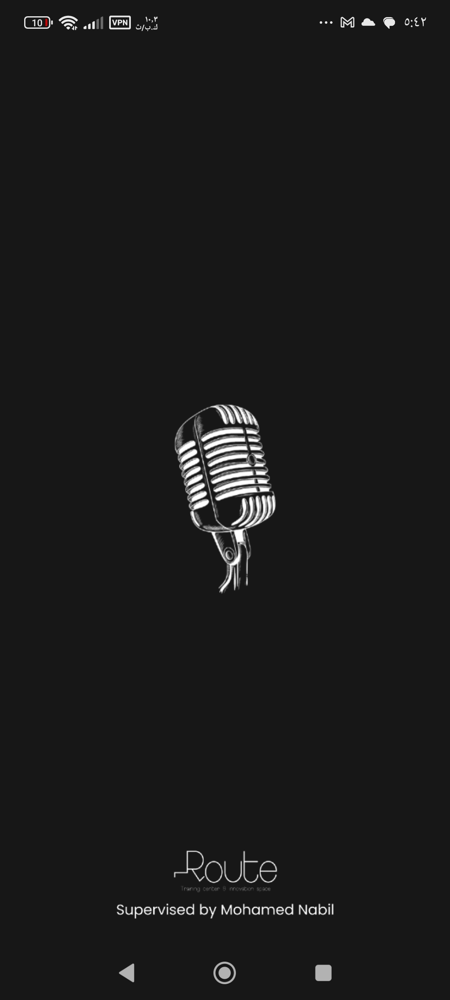

### 🏠 Home Screen

  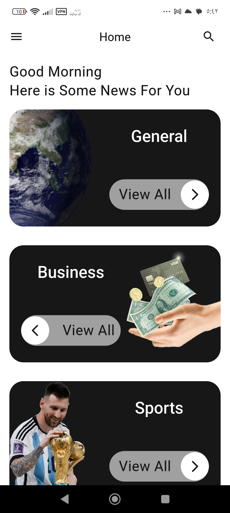
  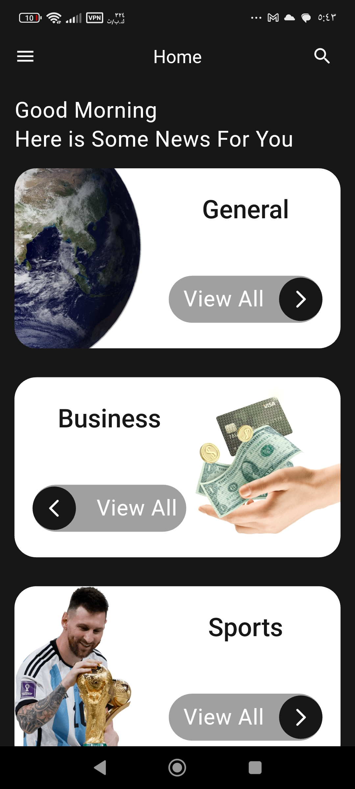

  
  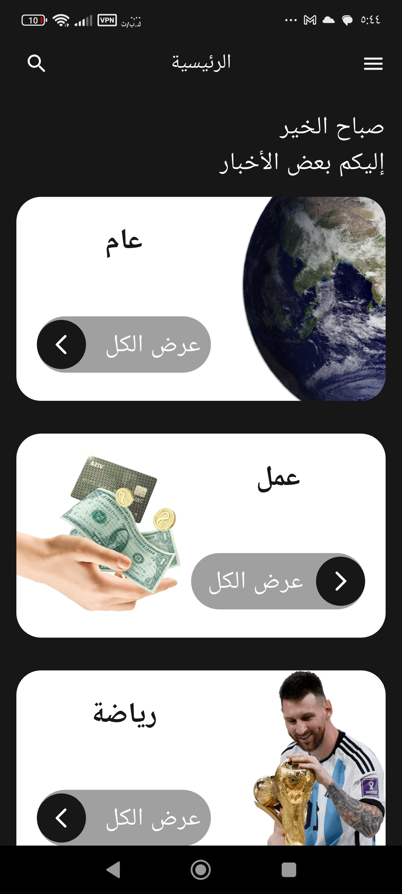

  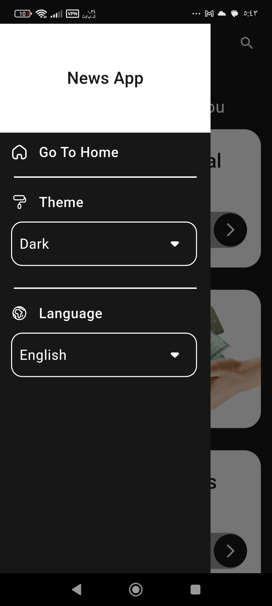
  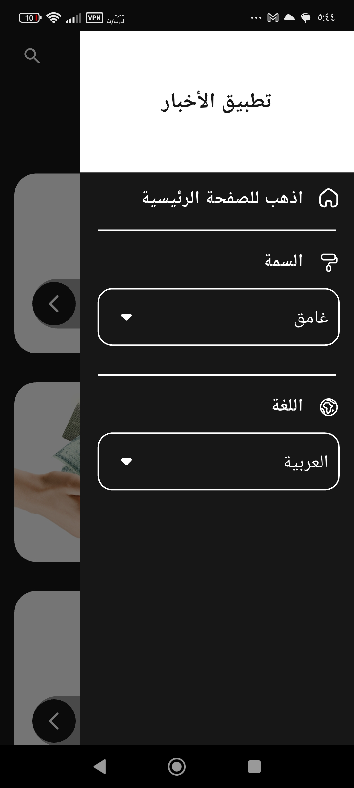

### 🗂️ Category News

  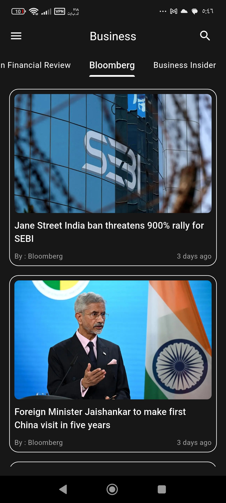

  

  
  

### 🔍 Search

  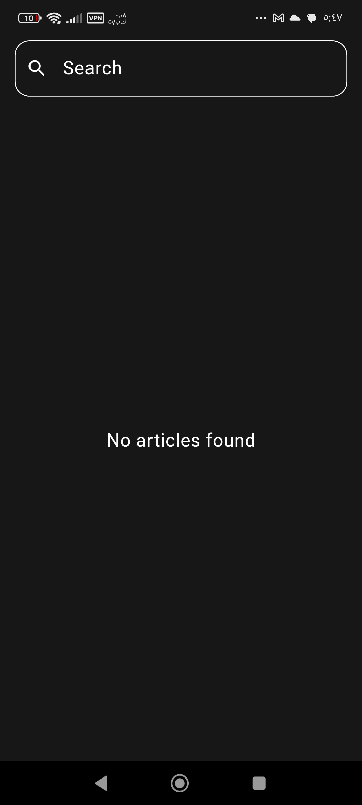
  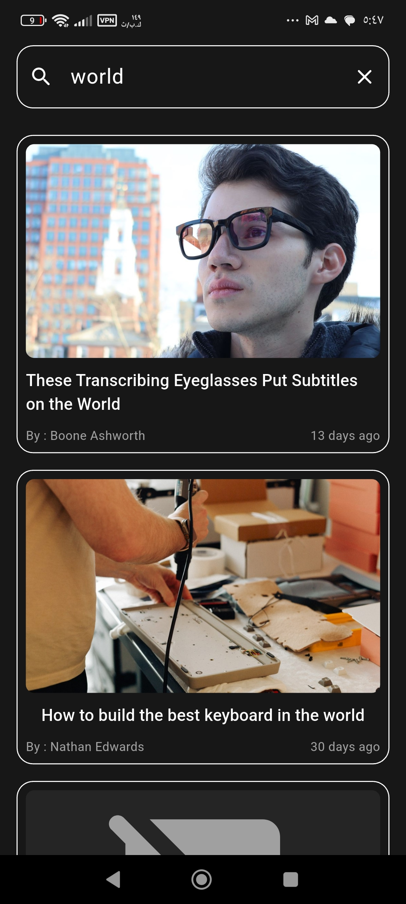
  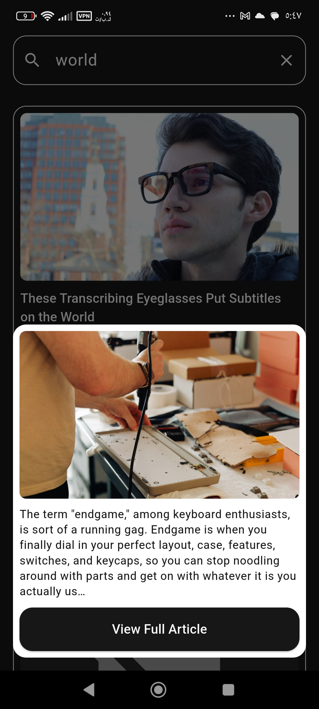

## 🧩 Tech Stack

- Flutter & Dart
- HTTP REST API
- Flutter localization (`intl`)
- Flutter ScreenUtil for responsiveness
- Material Design
- Bloc (state management)
- MVVM

---
